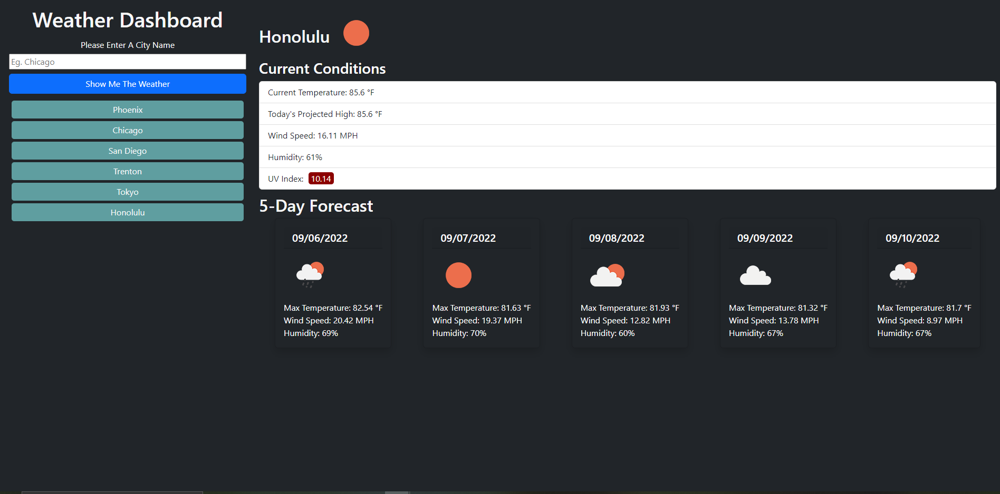

# The Weather Man Weather App 🌦⛅

This is a simple weather dashboard built using Open Weather API that allows you to enter a city name and instantly get the current weather conditions as well as a five-day forecast. Searches are saved so they can be revisited at the click of a button.

## Description
For years we waited eagerly in front of the TV for the person with the magic screen to show up and tell us how miserable the weather was going to make us. Enter the internet. We are no longer subjected to the forces of Al Roker. We can find out what's happening in our neck of the woods right now. 

The Weather Man is your personal weather man whenever you need it. It can tell you the weather at a moment's notice, is designed to be lightweight and appealing on any screen so whether you look at the weather on a computer or a phone you will be able to see what the fates have in store for you.

Working on this project taught me a lot about using fetch requests and Server Side APIs. I learned how to delve into the returned objects to access the information that I want to display and how to implement that information in a page. 

## Deployment

[Live Deployed Site](https://hburnton.github.io/theWeathermanWeatherApp/)

## Credits
This utilizes the Open Weather API and the page layout is built with bootstrap. All other code came from my noggin.

https://openweathermap.org/api

https://getbootstrap.com/docs/5.2/getting-started/introduction/